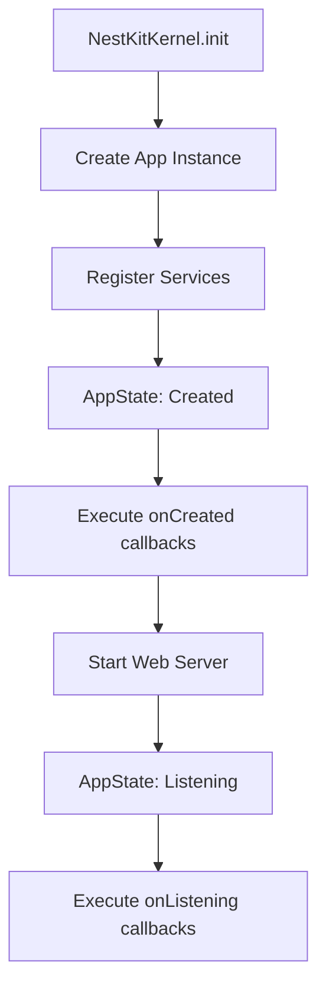

# @nestkit-x/kernel

The Kernel is the heart of the NestKit-X ecosystem - it's the core engine that provides effortless application bootstrap
with minimal but structured configuration, and offers a powerful application lifecycle management mechanism.

## Key Features

- **Streamlined Bootstrap**: Launch NestJS applications with a single line of code
- **Lifecycle Management**: StateService for controlling initialization phases
- **Extensibility**: Easy integration of both NestKit-X packages and custom modules
- **Prioritization**: Control callback execution order during initialization
- **Safe App Access**: Guaranteed access to app instance at the right moment

## Installation

```shell
npm install @nestkit-x/kernel @nestkit-x/core
```

## Quick Start

### 1. Create Configuration

```typescript
// configs/app.config.ts
import { APP_CONFIG, IAppConfig, registerConfig, Environment } from '@nestkit-x/core';

class AppConfig implements IAppConfig {
  readonly env = Environment.Development;
  readonly host = '0.0.0.0';
  readonly name = 'my-nestkit-x-app';
  readonly port = 3000;
  readonly version = '1.0.0';
}

export const appConfig = registerConfig(APP_CONFIG, AppConfig);
```

### 2. Bootstrap Application

```typescript
// main.ts
import { NestKitKernel } from '@nestkit-x/kernel';
import { AppModule } from './app/app.module';
import { appConfig } from './configs/app.config';

NestKitKernel.init(AppModule, appConfig);
```

Now your service is configured and ready for development.

## Application State Service

The key feature of the kernel is the **StateService** - a service for managing application lifecycle that allows modules
to register callbacks for execution at specific initialization phases.

### Lifecycle States

The kernel supports three application states:

1. **`NotReady`** - initial state when nothing has been initialized yet
2. **`Created`** - application created, DI tree built, but web server not started
3. **`Listening`** - application ready and accepting requests

:::note
The `NotReady` state is used as a initial state and doesn't have a corresponding method for registering callbacks.
:::

### Using StateService

StateService is available through the DI container and allows registering callbacks for different lifecycle phases:

```typescript
import { Inject, Injectable, Logger } from '@nestjs/common';
import { APP_STATE_SERVICE, IAppStateService } from '@nestkit-x/core';

@Injectable()
export class MyService {
  private readonly logger = new Logger(MyService.name);

  constructor(@Inject(APP_STATE_SERVICE) private readonly appStateService: IAppStateService) {
    // All hooks MUST be called in constructor
    this.appStateService.onCreated((app) => {
      this.logger.log('Application created, setting up middleware'); // Here you can configure middleware, logger, etc.
    });

    this.appStateService.onListening(() => {
      this.logger.log('Server ready to accept requests');
      // Here you can start background jobs, health checks, etc.
    });
  }
}
```

#### onCreated Hook

Triggers after the app instance is created and the DI tree is built, but before the web server starts.

**Perfect for:**

- Module initialization
- Database connections
- Middleware setup
- Logger configuration
- Cache warming

```typescript
this.appStateService.onCreated((app) => {
  app.useLogger(myCustomLogger);
});
```

#### onListening Hook

Triggers after the web server starts, when the application is ready to accept requests.

**Perfect for:**

- Final health checks
- Ready status logging
- Notifying external services
- Starting background jobs

```typescript
// Critical checks (execute first)
this.appStateService.onListening(() => {
  this.logger.log(`🚀 Server ready at http://localhost:${port}`);
});
```

### Callback Prioritization

StateService supports a priority system for controlling callback execution order:

- **Lower number = higher priority**
- **Range: -Infinity to +Infinity**
- **Default: 0**

```typescript
// Executes first
this.appStateService.onCreated(setupLogger, -10000);

// Executes second
this.appStateService.onCreated(setupMiddleware, -1000);

// Executes third (default)
this.appStateService.onCreated(initializeServices);

// Executes last
this.appStateService.onCreated(logInitComplete, 1000);
```

:::tip Priorities in NestKit-X
System NestKit-X packages use specific priorities:

- `@nestkit-x/logger`: -10,000 (guaranteed to be first)
- `@nestkit-x/compression`: -9,999
- `@nestkit-x/config`: -9,998

For your services, it's recommended to use priorities from -999 to 999, but there will be no problems in case of
collisions
:::

### Callback Types

Callbacks can return different data types but all types represents void anyway:

```typescript
// Synchronous void
this.appStateService.onCreated(() => {
  console.log('Ready!');
});

// Promise
this.appStateService.onCreated(async () => {
  await this.databaseService.connect();
});

// Observable t
his.appStateService.onCreated(() => {
  return this.configService.load$();
});

// With access to app instance
this.appStateService.onCreated((app) => {
  app.use(cors());
  this.setupCustomMiddleware(app);
});
```

### Sequential Execution

It's important to understand that StateService executes callbacks **sequentially**:

- All `onCreated` callbacks must complete successfully before transitioning to `onListening`
- Each subsequent callback waits for the previous one to complete
- If a callback fails, the error is logged but execution continues (if you want to prevent it - throw RuntimeException)

```typescript
// This callback will block subsequent ones until completion
this.appStateService.onCreated(async () => {
  await this.longRunningTask(); // Blocks subsequent callbacks
});
this.appStateService.onCreated(() => {
  // Executes only after the previous one completes
  console.log('Executes after longRunningTask');
});
```

## Direct App Instance Access

Besides StateService, the kernel provides **AppRefService** for direct access to the app instance:

```typescript
import { Inject, Injectable } from '@nestjs/common';
import { APP_REF_SERVICE, IAppRefService } from '@nestkit-x/core';

@Injectable()
export class MyAdvancedService {
  constructor(@Inject(APP_REF_SERVICE) private readonly appRef: IAppRefService) {}

  someMethod() {
    // ⚠️ WARNING: Can only be called after onCreated hooks execute!
    const app = this.appRef.get(); // Work with app instance
  }
}
```

:::warning Be Careful with AppRefService
AppRefService can only be used after the `onCreated` hook has triggered. Calling `appRef.get()` before this moment will
result in an error.

It's recommended to use StateService instead of direct access to AppRefService.
:::

## Extending the Ecosystem

StateService makes extending NestKit-X extremely simple. Each module can register its callbacks:

```typescript
@Injectable()
export class SwaggerService {
  public constructor(
    @Inject(APP_STATE_SERVICE)
    private readonly appState: IAppStateService,
  ) {
    this.appState.onCreated((app) => {
      const config = new DocumentBuilder().build();
      const document = SwaggerModule.createDocument(app, config);
      SwaggerModule.setup('api', app, document);
    });
  }
}
```

This allows creating modules that:

- Don't require configuration in `main.ts`
- Automatically integrate into the lifecycle
- Can control initialization order
- Work together without conflicts

:::info Scope.REQUEST is an Anti-pattern
You should avoid using `Scope.REQUEST` in
NestJS. [More](https://docs.nestjs.com/fundamentals/injection-scopes#performance)

Instead, it's recommended to use [`nestjs-cls`](https://papooch.github.io/nestjs-cls/) for request context
management or integrated [`@nestkit-x/cls`](../packages/10-cls.md).
:::

## Architecture

The kernel is built around several key components:

- **NestKitKernel** - main class for bootstrapping
- **KernelModule** - module that registers all necessary services
- **AppStateService** - lifecycle management
- **AppRefService** - access to app instance



This architecture ensures:

- Predictable initialization order
- Ability to extend without changing kernel code
- Safe access to resources at the right moment
- Simple integration of new modules

The kernel is the foundation upon which the entire NestKit-X ecosystem is built, making NestJS application development
faster, cleaner, and more structured.
